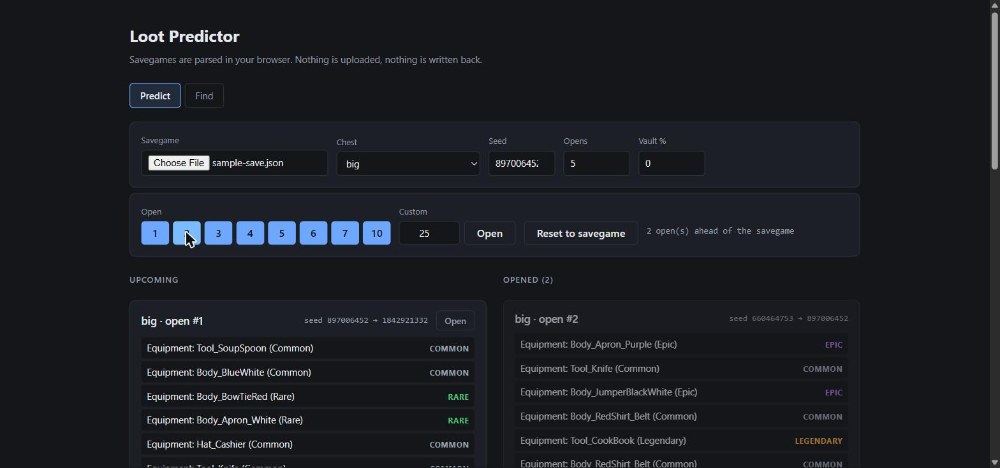
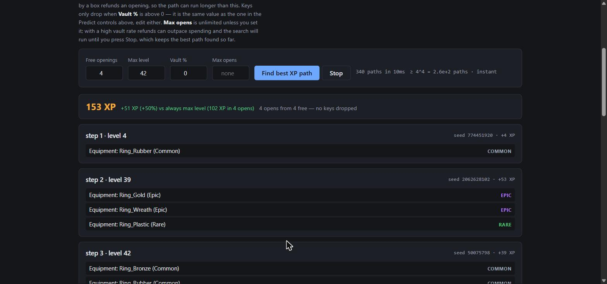
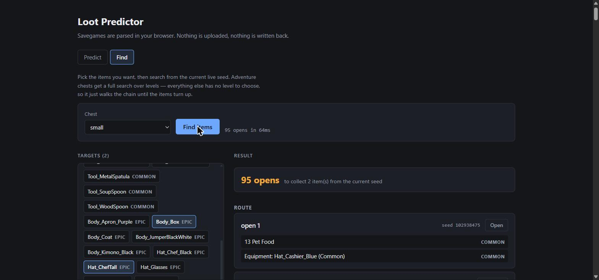

# Loot Predictor

Reverse-engineered Unity PRNG + loot tables — predict chest drops before you open them.

The game persists one int32 seed per chest and advances it on every open. Rebuild
the generator and the draw order, and the whole future chain becomes readable:
what the next open contains, what the one after that contains, and which
adventure level to replay so the chain lands on the loot you want.

Savegames are parsed entirely in the browser. Nothing is uploaded, nothing is
written back to the save.

## How it works

- **PRNG** — the engine does not use an LCG. It uses C#'s `System.Random`
  (Knuth subtractive / lagged Fibonacci), which Mono ships and which the
  persisted per-chest `Seed` is fed into. Ported draw for draw in
  `src/rng/unity-random.js`.
- **Draw order** — per item: draw 1 picks the prize type from a weighted table,
  draw 2 picks the item inside that rarity pool. After the last item, one final
  draw produces the seed persisted for the *next* open. That trailing draw is
  why chests chain.
- **Loot tables** — mapped empirically from logged openings (`src/loot/tables.js`).
- **Savegame** — the file is prefixed with a base64 integrity hash before the
  JSON body, so the parser slices from the first `{` to the last `}`.

## Run

    npm install
    npm run dev

## Web UI

### Predict — walk the chain

Load a savegame, pick a chest, and read forward. "Open" advances the live seed
so the tool stays in sync with the game; **Reset to savegame** rewinds to the
file's seed. Both the live seed and the opened history survive a refresh.



### Smart XP — pick the replay order

Adventure chests let you choose a level per open, and the level you pick for
open #1 changes every draw after it. So the best route is a search, not a
per-open choice: a weak first open at a low level can set up a much better
second one. Vault keys refund an opening, so a path can run deeper than the
free-openings budget suggests.



### Find — hunt specific items

Pick the items you want and search from the current live seed. Adventure chests
get a full search over levels; everything else has no level to choose, so it
walks the chain until the items turn up.



## CLI

    node tools/predict.mjs <savegame.json> [cardId] [count]

With no `cardId`, it lists every chest and egg in the save:

    $ node tools/predict.mjs savegame.json
    chests found in save:

      small                seed=  102938475  opened=37
      big                  seed=    1839201  opened=12
      adventure_Zeus       seed=  774451920  opened=88  level=42
      adventure_Pirate     seed=   49281773  opened=5  level=17
      egg_Epic             seed=  662310945

With a `cardId`, it walks the chain:

    $ node tools/predict.mjs savegame.json big 3
    big  seed=1839201  next 3 opens

    open #1  (seed 1839201)
        Equipment: Body_Apron_Purple (Epic)
        Equipment: Hat_Cashier (Common)
        Equipment: Hat_Cashier_Blue (Common)
        Equipment: Tool_SoupSpoon (Common)
        Equipment: Body_Apron_Purple (Epic)
        Equipment: Hat_Chef_Black (Epic)
        -> nextSeed 660464753
    open #2  (seed 660464753)
        ...

Adventure chests also report the key roll, which is consumed whether or not the
vault percentage is high enough for a key to drop:

    $ node tools/predict.mjs savegame.json adventure_Zeus 2
    adventure_Zeus  seed=774451920  next 2 opens

    open #1  (seed 774451920)
        Equipment: Ring_Rubber (Common)
        Equipment: Ring_Plaster (Common)
        Equipment: Ring_Plaster (Common)
        Equipment: Ring_Onion (Rare)
        [keyRoll 14]
        -> nextSeed 1814281912

## Library use

```js
import { parseSavegame } from "./src/save/parse.js";
import { predictChain } from "./src/loot/simulate.js";
import { findItemLinear } from "./src/solver/find-items.js";

const states = parseSavegame(readFileSync("savegame.json", "utf8"));

// Next 5 opens of the big chest.
const chain = predictChain(states.big.initialSeed, "big", 5);

// Cheapest route to a specific item, walking the chain.
const route = findItemLinear(states.big.initialSeed, "big", ["Hat_ChefTall"], {
  limit: 10000
});
```

Chest ids: `small`, `big`, `clan`, `pet`, `adventure_Zeus`, `adventure_Pirate`,
`event_*` (`SeaPort`, `Space`, `Mine`, `MiddleAges`, `Alchemist`), and
`egg_Rare` / `egg_Epic` / `egg_Legendary` / `egg_Ultimate`.

## Layout

- `src/rng/unity-random.js` — PRNG reimplementation
- `src/loot/tables.js` — loot table data, mapped empirically
- `src/loot/simulate.js` — draw order and chest/egg/adventure simulation
- `src/loot/xp.js` — per-item XP values
- `src/save/parse.js` — savegame parsing
- `src/solver/xp-path.js` — max-XP replay search
- `src/solver/find-items.js` — cheapest-path item hunt
- `src/ui/render.js` — DOM rendering helpers
- `src/app.js` — UI wiring
- `tools/predict.mjs` — CLI

## Notes

Screenshots use a synthetic savegame, so the seeds and drops shown are examples,
not anyone's real save.
